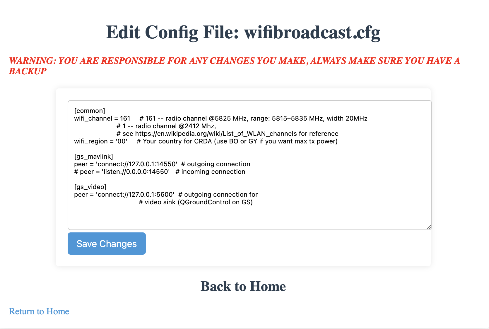
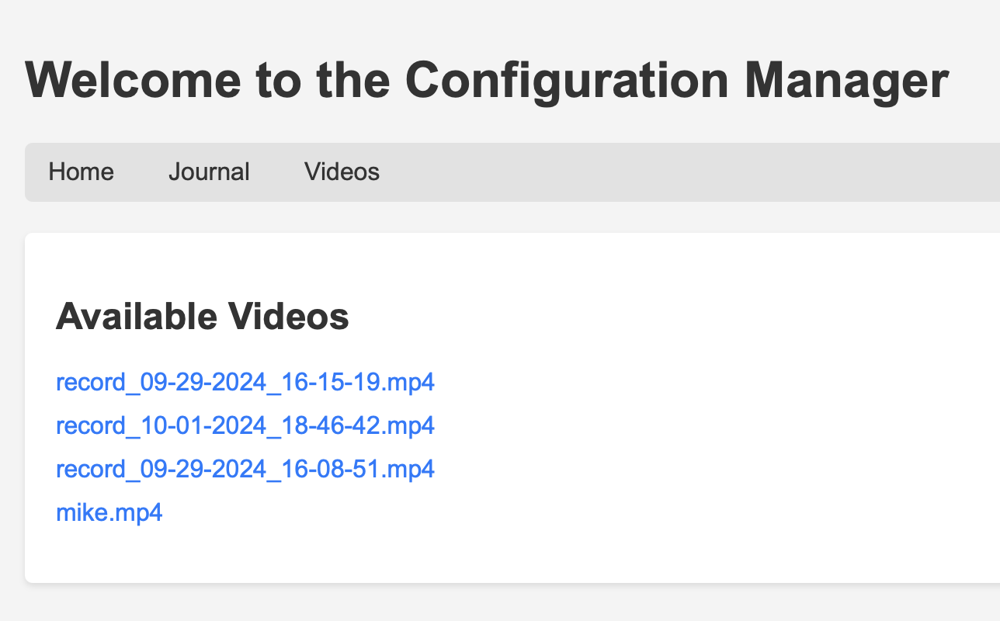
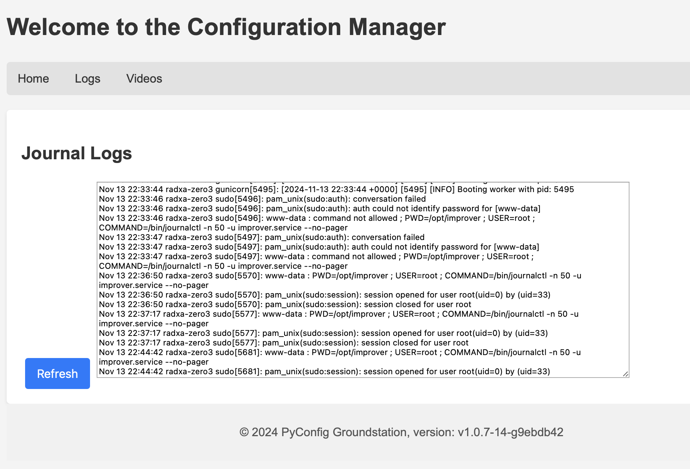
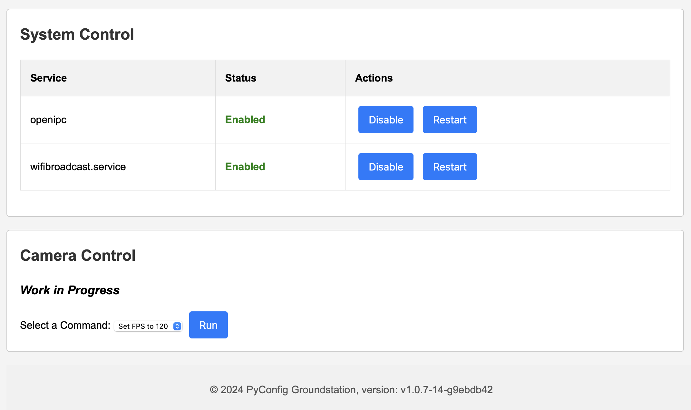

# Improver

*Temporarily put on hold since the work being done to put this in Betaflight Menus and to work on Avalonia Configurator ([OpenIPC-Config](https://github.com/mikecarr/OpenIPC-Config)) MultiPlatform Configurator.*


OpenIPC Improver for setting up FPV and URLLC devices

I wanted an easy way to edit files and watch videos on the Radxa

### Screenshots
Home Page


Editor


Video file selector


Player


Journalctl -f


### Dev Setup and Running
```bash
python -m venv .venv
source .venv/bin/activate
pip install -r requirements.txt

echo "FLASK_ENV=development > .env"
```


### Screenshots
Home Page




Editor


Video file selector


Player


Journalctl -f


Explanation of Makefile Targets
* build: Builds the Docker images as specified in docker-compose.yml.
* run: Builds (if needed) and runs the containers in the foreground.
* run-detached: Builds (if needed) and runs the containers in detached mode (background).
* stop: Stops all running containers defined in docker-compose.yml.
* logs: Shows real-time logs from all services for debugging.
* clean: Stops containers and removes all images, volumes, and orphaned containers associated with this Docker Compose setup.

## Usage
1. Build the Images:
```
make build
```
2. Run the Containers in Foreground:
```
make run
```
3. Run the Containers in Detached Mode:
```
make run-detached
```
4. Stop the Containers:
```
make stop
```
5. View Logs:
```
make logs
```
6. Clean Up Containers and Images:
```
make clean
```

With this Makefile, you can easily manage the lifecycle of your multi-container setup for testing the Flask app with Nginx in Docker. Let me know if you need more customization!


## Service file

Copy file to /etc/systemd/system/improver.service

### Enable and Start the Service

* Reload the systemd daemon to pick up the new service:
    ```
    sudo systemctl daemon-reload
    ```
* Enable the service to start on boot:
    ```
    
<br><br>
<hr>
<h3>This is an open project, so you can help, too.</h3>

We try to collect, organize and share as much information regarding different aspects of the project as we can. But sometimes we overlook things that seem obvious to us, developers, but are not so obvious to end-users, people who are less familiar with nuts and bolts behind the scene. That is why we set up this wiki and let anyone having a GitHub account to make additions and improvements to the knowledgebase. Read [How to contribute](https://github.com/OpenIPC/wiki/blob/master/en/contribute.md).