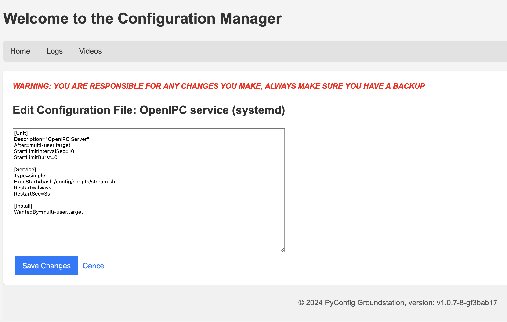

# py-config.gs


I wanted an easy way to edit files and watch videos on the Radxa

### Dev Setup and Running
```
python -m venv .venv
source .venv/bin/activate
pip install -r requirements.txt
```


### Screenshots
Home Page


Editor


Video file selector


Player

