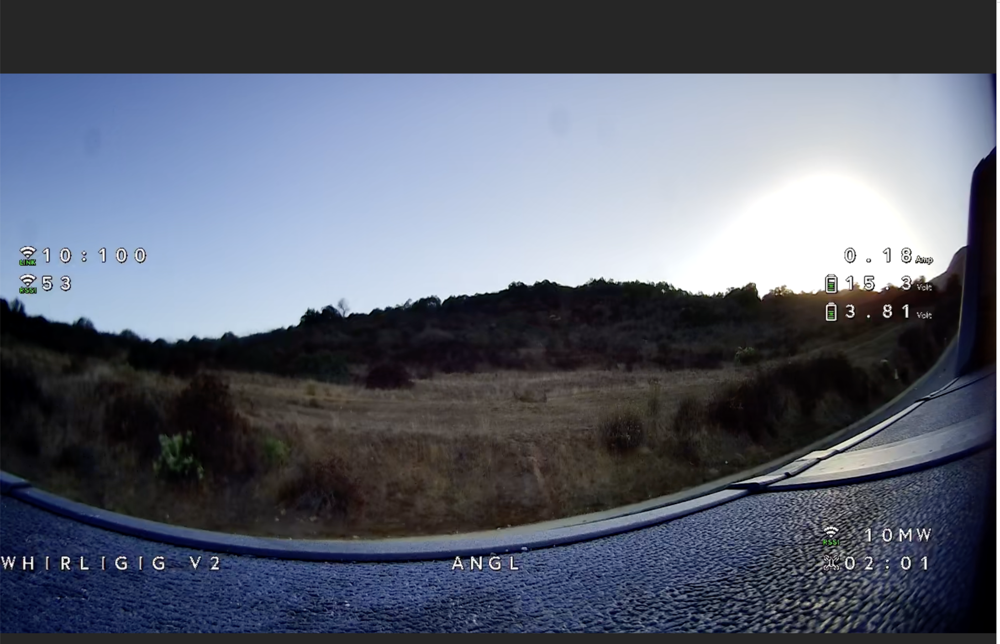

# py-config.gs


I wanted an easy way to edit files and watch videos on the Radxa

### Dev Setup and Running
```bash
python -m venv .venv
source .venv/bin/activate
pip install -r requirements.txt

echo "FLASK_ENV=development > .env"
```


### Screenshots
Home Page


Editor


Video file selector


Player


Journalctl -f


### Packaging
```bash
python setup.py sdist bdist_wheel
```

check dist/


###

Virtual Environment: If you are working in a virtual environment, ensure it is activated before running the pip install command:

```
# Install virtualenv if not installed
pip install virtualenv

# Create a virtual environment
virtualenv venv

# Activate the virtual environment
source venv/bin/activate  # For Linux/Mac

pip install .
or
python setup.py install


```
## config file
```
cp /usr/local/lib/python3.9/dist-packages/config/py-config-gs.json /config
cp /usr/local/lib/python3.9/dist-packages/etc/systemd/system/py-config-gs.service /etc/systemd/system/
sudo systemctl daemon-reload

sudo systemctl start py-config-gs

# Optional, you can always run the command above out in the field if you are worried about resource consumption
sudo systemctl enable py-config-gs
```


### Uninstall
```
pip uninstall py_config_gs-0.1-py3-none-any.whl
```

<br><br>
<hr>
<h3>This is an open project, so you can help, too.</h3>

We try to collect, organize and share as much information regarding different aspects of the project as we can. But sometimes we overlook things that seem obvious to us, developers, but are not so obvious to end-users, people who are less familiar with nuts and bolts behind the scene. That is why we set up this wiki and let anyone having a GitHub account to make additions and improvements to the knowledgebase. Read [How to contribute](https://github.com/OpenIPC/wiki/blob/master/en/contribute.md).