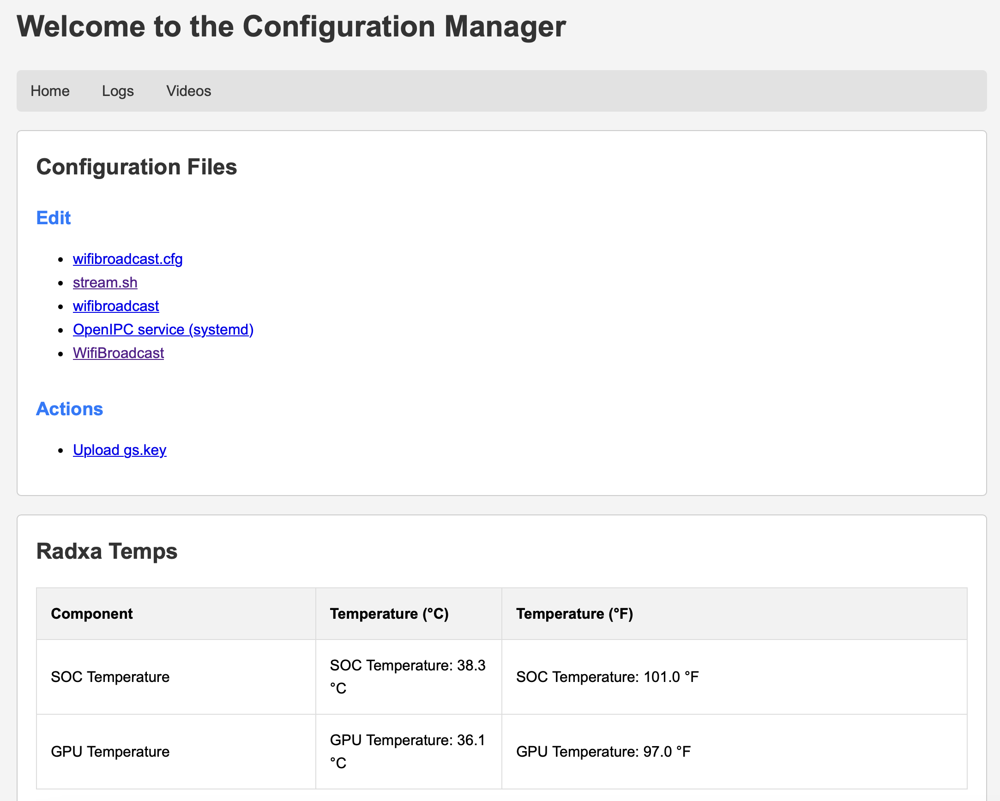

# py-config-gs

*Temporarily put on hold since the work being done to put this in Betaflight Menus and to work on Avalonia Configurator ([OpenIPC-Config](https://github.com/mikecarr/OpenIPC-Config)) MultiPlatform Configurator.*

OpenIPC Improver for setting up FPV and URLLC devices

I wanted an easy way to edit files and watch videos on the Radxa


### Screenshots
Home Page


Editor


Video file selector


Player


Journalctl -f


## Packaging and Installation

* Install build Tool:
    ```
    pip install build
    ```

* Package the Application:
    ```
    python -m build
    ```

    Check the dist/ Directory for the package:
    ```
    ls dist/
    ``` 

    The wheel file will have a name similar to py-config-gs-1.0.6-py3-none-any.whl.

* Install the Package:
    ```
    pip install dist/py-config-gs-1.0.6-py3-none-any.whl
    ```

    Note: The setup.py install method is deprecated. Use standards-based tools like pypa/build or pip with the --use-pep517 option. For more information, see this article.


## Run the Application:

* Locally for development/testing:
    ```bash
    flask run
    ```

* Production using Gunicorn:
    ```bash
    gunicorn -w 4 -b 0.0.0.0:5001 py_config_gs.app:app
    ```
* Using Systemd:
    ```
    sudo systemctl start py-config-gs
    ```

## Docker Option (Optional):

To build and run the Docker container:

* Build the Docker Image:
    ```
    docker build -t py-config-gs .
    ```

* Run the Docker Container:
    ```
    docker run -d -p 5001:5001 py-config-gs
    ```


### Virtual Environment: If you are working in a virtual environment, ensure it is activated before running the pip install command:

1. Install virtualenv if not installed
    ```
    pip install virtualenv
    ```

2. Create and activate a virtual environment
    ```
    virtualenv venv
    source venv/bin/activate  # For Linux/Mac
    ```
3. Install the package:
    ```
    pip install .
    ```
    or
    ```
    python setup.py install
    ```

## Configuration File Setup

1. Copy the configuration file:
    ```
    cp /usr/local/lib/python3.9/dist-packages/config/py-config-gs.json /config
    ```

2. Copy the systemd service file:
    ```
    cp /usr/local/lib/python3.9/dist-packages/etc/systemd/system/py-config-gs.service /etc/systemd/system/
    sudo systemctl daemon-reload
    sudo systemctl start py-config-gs
    ```

3. (Optional) Enable the service to start on boot:
    ```
    sudo systemctl enable py-config-gs
    ```


### Uninstall
    ```
    pip uninstall py_config_gs-0.1-py3-none-any.whl
    ```

<br><br>
<hr>
<h3>This is an open project, so you can help, too.</h3>

We try to collect, organize and share as much information regarding different aspects of the project as we can. But sometimes we overlook things that seem obvious to us, developers, but are not so obvious to end-users, people who are less familiar with nuts and bolts behind the scene. That is why we set up this wiki and let anyone having a GitHub account to make additions and improvements to the knowledgebase. Read [How to contribute](https://github.com/OpenIPC/wiki/blob/master/en/contribute.md).
